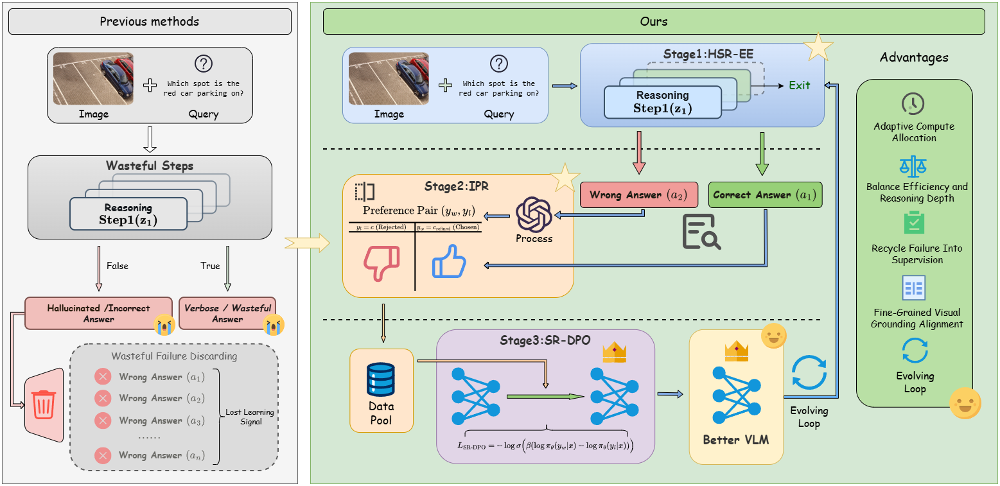
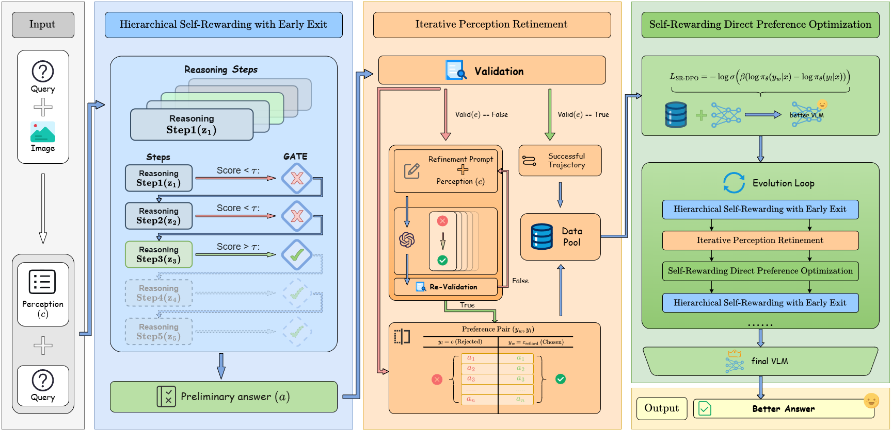

<div align="center">

# From Self-Rewarding to Self-Evolving
## A Unified Framework for Adaptive Multimodal Reasoning

Changbin Cheng<sup>1*</sup>, Jisheng Dang<sup>1</sup>, Bimei Wang<sup>1</sup>, Yulan Guo<sup>2</sup>, Bin Hu<sup>3</sup>, Tat-Seng Chua<sup>4</sup>

<sup>1</sup>Lanzhou University &nbsp; <sup>2</sup>National University of Defense Technology &nbsp; <sup>3</sup>Beijing Institute of Technology &nbsp; <sup>4</sup>National University of Singapore

<!-- [](https://arxiv.org/abs/2508.xxxxx) -->
[](LICENSE)
[](https://github.com/volcengine/verl)
[](https://github.com/hiyouga/LLaMA-Factory)

</div>

---

## 📖 Introduction

> **Core Concept**: Transition from "static and passive" self-rewarding to "dynamic and active" self-evolving.

Existing Vision-Language Models (VLMs) are often constrained by **visual hallucinations** and **language shortcuts**. Traditional "self-rewarding" paradigms typically rely on static reasoning chains and coarse-grained binary rewards, making it difficult to handle complex visual logic.

This project is the official implementation of the paper **"From Self-Rewarding to Self-Evolving: A Unified Framework for Adaptive Multimodal Reasoning"**. We propose a unified **Self-Evolving Framework** that enables adaptive reasoning depth and turns failed trajectories into reusable optimization signals, so the model can continuously improve visual grounding and reduce language shortcuts.



### ✨ Key Features

Our framework consists of three core components:

1.  **🧠 HSR-EE (Hierarchical Self-Rewarding with Early Exit)**: 
    * **Dynamic Reasoning**: Breaks free from fixed computational budgets. Simple perceptual tasks (e.g., "Is there a cat?") can exit early, while complex multi-hop reasoning automatically deepens the reasoning level.
    * **Resolving Paradox**: Effectively balances reasoning efficiency and depth (Efficiency-Depth Paradox).
    
2.  **🔄 IPR (Iterative Perception Refinement)**:
    * **Active Error Correction**: A closed-loop data engine. Instead of discarding failed attempts, it transforms model hallucinations into high-quality "negative samples".
    * **Self-Evolution**: Forces the model to correct perception through "re-examination", generating paired preference data.

3.  **⚖️ SR-DPO (Self-Rewarding Direct Preference Optimization)**:
    * **Fine-grained Alignment**: Utilizes Hard Negatives generated by the VLM itself for direct preference optimization.
    * **Robustness**: Compared to traditional Binary PPO, SR-DPO can more precisely suppress hallucinations and prevent Reward Hacking.

---

## 🚀 Methodology


*(Overview of HSR-EE, IPR, and SR-DPO.)*


### 1. Dynamic Reasoning (Stage 1: HSR-EE)
The model passes through a confidence gate ($g_{\phi}$) after each reasoning step.
- If confidence > threshold $\tau$, the model performs **Early Exit** and outputs the answer.
- Otherwise, continue with deeper Chain-of-Thought reasoning.

### 2. Closed-loop Data Engine (Stage 2: IPR)
When the model's answer is detected as incorrect (based on $a_{gt}$) during training, the IPR module injects a Refinement Prompt ("Your description is inaccurate, please re-examine...") to guide self-correction.
- **Winner ($y_w$)**: Corrected and accurate visual perception.
- **Loser ($y_l$)**: Original hallucinated perception.

### 3. Preference Optimization (Stage 3: SR-DPO)
Using the constructed $(y_w, y_l)$ pairs, we minimize the probability of the hallucination path and maximize the correction path via the DPO objective:

```math
\mathcal{L}_{SR-DPO} = -\mathbb{E} \left[ \log \sigma \left( \beta \log \frac{\pi_{\theta}(y_w|x)}{\pi_{ref}(y_w|x)} - \beta \log \frac{\pi_{\theta}(y_l|x)}{\pi_{ref}(y_l|x)} \right) \right]
```
---

## 📊 Experimental Results


Our method achieves SOTA performance on multiple benchmarks and significantly reduces language shortcuts.

| Benchmark | Qwen2.5-VL-7B | **Ours** (Self-Evolving) | Improvement |
| :--- | :---: | :---: | :---: |
| **MMMU (Val)** | 58.6 | **62.1** | 🟢 +3.5 |
| **MM-Vet** | 69.7 | **71.2** | 🟢 +1.5 |
| **POPE (F1)** | 85.9 | **90.2** | 🟢 +4.3 |

> 📉 **Hallucination Rate**: While maintaining efficient reasoning, we reduce the hallucination rate by **40%+**.

---

## 🛠️ Getting Started

### Requirements

- **Python**: 3.10 or higher
- **GPU**: NVIDIA GPU with at least 24GB VRAM recommended (for full fine-tuning)
- **CUDA**: 11.8 or higher

### Installation

```bash
# Clone the repository
git clone https://github.com/your-org/SR2SE.git
cd SR2SE

# Create virtual environment
conda create -n self-evolving python=3.11
conda activate self-evolving

# Install dependencies
pip install -r requirements.txt

# Or install as package (with optional training dependencies)
pip install -e ".[train]"
```

### Project Structure

```
SR2SE/
├── src/                          # Core framework implementation
│   ├── __init__.py
│   ├── config.py                 # All configuration dataclasses (HSR-EE, IPR, SR-DPO, SFT, Model)
│   ├── verl_integration.py       # veRL distributed training integration
│   ├── models/
│   │   ├── confidence_head.py    # g_φ confidence gate MLP (Eq.10-12) + REINFORCE adaptive τ
│   │   └── vlm_wrapper.py        # VLM wrapper with sub-policy decomposition (π_perc, π_reason, π_text)
│   ├── hsr_ee/
│   │   └── inference.py          # HSR-EE dynamic reasoning engine (Algorithm 1) + gate trainer
│   ├── ipr/
│   │   └── data_engine.py        # IPR preference pair construction (Algorithm 3)
│   ├── sr_dpo/
│   │   └── trainer.py            # SR-DPO loss (Eq.20-21) + full training loop
│   └── training/
│       └── pipeline.py           # Complete 3-stage pipeline orchestrator (Algorithm 2)
├── reward_func/
│   ├── full_framework.py         # Reward functions: R_HSR, Bellman Q, gate loss, DPO loss
│   └── ablation.py               # Ablation experiment configurations
├── scripts/
│   ├── run_pipeline.py           # One-click full pipeline (SFT → IPR + Gate → SR-DPO)
│   ├── generate_ipr_data.py      # Standalone IPR preference data generation
│   ├── train_hsr_ee.py           # Standalone confidence gate training
│   ├── train_sr_dpo.py           # Standalone SR-DPO training
│   └── inference.py              # Inference with trained model + HSR-EE early exit
├── configs/
│   └── default_config.json       # Default hyperparameters matching the paper
├── LlamaFactory/                 # SFT training framework (submodule)
├── verl/                         # RL training framework (submodule)
├── evalscope/                    # Evaluation framework (submodule)
├── requirements.txt
└── setup.py
```

### Training Pipeline

Our training consists of three stages. You can run the **full pipeline** with a single command, or execute each stage individually.

#### Option A: Full Pipeline (Recommended)

```bash
# Run the complete 3-stage training pipeline
python scripts/run_pipeline.py --config configs/default_config.json

# Or specify individual arguments
python scripts/run_pipeline.py \
    --model_path Qwen/Qwen-VL-Chat \
    --data_dir ./data \
    --output_dir ./output
```

#### Option B: Stage-by-Stage Execution

##### Stage 1: SFT Initialization (based on LlamaFactory)

Initialize the base VLM with supervised fine-tuning:

```bash
cd LlamaFactory
python src/train.py \
    --model_name_or_path Qwen/Qwen-VL-Chat \
    --dataset llava_instruct_150k \
    --output_dir ./output/sft_ckpt \
    --num_train_epochs 1 \
    --learning_rate 5e-5 \
    --per_device_train_batch_size 4 \
    --gradient_accumulation_steps 4
```

##### Stage 2: IPR Data Generation + HSR-EE Gate Training

Generate preference pairs via Iterative Perception Refinement, then train the confidence gate:

```bash
# Generate IPR preference data (Algorithm 3)
python scripts/generate_ipr_data.py \
    --model_path ./output/sft_ckpt \
    --data_dir ./data \
    --output_dir ./output/ipr_data \
    --max_refinement 2 \
    --max_samples 50000

# Train HSR-EE confidence gate (g_φ with adaptive τ)
python scripts/train_hsr_ee.py \
    --model_path ./output/sft_ckpt \
    --data_dir ./data \
    --output_dir ./output/hsr_ee_ckpt \
    --num_epochs 5 \
    --threshold 0.7 \
    --adaptive_threshold
```

##### Stage 3: SR-DPO Preference Optimization

Apply self-rewarding DPO with IPR-generated hard negatives:

```bash
# Native SR-DPO trainer
python scripts/train_sr_dpo.py \
    --model_path ./output/sft_ckpt \
    --preference_data ./output/ipr_data/preferences.jsonl \
    --output_dir ./output/sr_dpo_ckpt \
    --beta 0.1 \
    --learning_rate 5e-7 \
    --batch_size 64 \
    --num_epochs 3

# Or use veRL for distributed training
cd verl
python -m verl.trainer.main_ray \
    --total_epochs 3 \
    --beta 0.1
```

### Inference

Run inference with the trained model using HSR-EE early exit:

```bash
# Single image inference
python scripts/inference.py \
    --model_path ./output/sr_dpo_ckpt \
    --image path/to/image.jpg \
    --question "What is shown in this image?" \
    --confidence_head_path ./output/hsr_ee_ckpt/confidence_head.pt

# Batch inference on dataset
python scripts/inference.py \
    --model_path ./output/sr_dpo_ckpt \
    --data_dir ./data/test \
    --output_dir ./output/predictions \
    --use_early_exit
```

### Data Preparation

Prepare your training data in JSONL format (one JSON object per line):

```json
{"image": "path/to/image.jpg", "question": "What objects are in the image?", "answer": "A cat sitting on a windowsill"}
```

The IPR data engine will automatically generate preference pairs in the following format:

```json
{
    "image_path": "path/to/image.jpg",
    "question": "What objects are in the image?",
    "ground_truth": "A cat sitting on a windowsill",
    "chosen": "[refined perception with corrected details]",
    "rejected": "[original hallucinated perception]",
    "iteration": 1
}
```

### Configuration

All hyperparameters are centralized in `configs/default_config.json`. Key settings:

| Parameter | Default | Description |
|-----------|---------|-------------|
| `hsr_ee.confidence_threshold` (τ) | 0.7 | Early exit confidence threshold (REINFORCE-optimized) |
| `hsr_ee.max_reasoning_steps` (K) | 5 | Maximum reasoning depth |
| `hsr_ee.length_penalty_lambda` (λ) | 0.1 | Penalty for each additional reasoning step |
| `sr_dpo.beta` (β) | 0.1 | DPO regularization strength |
| `sr_dpo.learning_rate` | 5e-7 | SR-DPO learning rate |
| `sr_dpo.batch_size` | 64 | Training batch size |
| `ipr.max_refinement_iterations` | 2 | Max perception refinement rounds |

You can also create configs programmatically:

```python
from src.config import FrameworkConfig

config = FrameworkConfig()
config.hsr_ee.confidence_threshold = 0.8
config.sr_dpo.beta = 0.05
config.save("configs/my_config.json")
```

### Evaluation

Evaluate model performance on multiple benchmarks:

```bash
cd evalscope
python -m evalscope.run \
    --model_type llm \
    --model_name_or_path ../output/sr_dpo_ckpt \
    --datasets mmmu pope mathvista mm_vet \
    --output_dir ../output/eval_results
```

---

## � Module Details

### Confidence Head (`g_φ`)
The confidence gate is a lightweight MLP that maps hidden states to an exit probability (Eq. 10):
$$\text{Score}_k = \sigma(g_\phi(H_k))$$

The gate threshold τ is optimized via REINFORCE (Eq. 12) to balance efficiency and accuracy adaptively during training.

### IPR Data Engine
Implements Algorithm 3 from the paper. For each training sample:
1. Generate initial perception `c_0` → validate against `a_gt`
2. If incorrect, inject refinement prompt and generate `c_1` → re-validate
3. Construct preference pair: `y_w = c_refined`, `y_l = c_original`
4. Repeat up to `N_max` iterations

### SR-DPO Loss
The SR-DPO loss (Eq. 20-21) with implicit reward modeling:
$$f_\theta(x, y_w, y_l) = \beta \log \frac{\pi_\theta(y_w|x)}{\pi_{\text{ref}}(y_w|x)} - \beta \log \frac{\pi_\theta(y_l|x)}{\pi_{\text{ref}}(y_l|x)}$$
$$\mathcal{L}_{\text{SR-DPO}} = -\mathbb{E}[\log \sigma(f_\theta)]$$

### Reward Functions
`reward_func/full_framework.py` provides all reward computations used throughout the framework:
- `hsr_ee_reward_batch`: Batched HSR reward (R = r_visual + r_ans − λk)
- `bellman_q_value`: MDP Bellman Q-value for step-level reasoning
- `gate_loss`: BCE loss for confidence head training (Eq. 11)
- `sr_dpo_loss`: Full DPO loss with metrics (Eq. 20-21)
- `compute_regret_bound`: Theoretical regret bound (Proposition 1)

---

## �🤝 Acknowledgements

This project builds upon the contributions of the open-source community. We especially thank the following excellent open-source projects and research:

- **Baseline & Inspiration**:
  - [Vision-SR1: Self-rewarding vision-language model via reasoning decomposition](https://arxiv.org/abs/2508.19652) (Li et al., 2025)

- **Fine-Tuning Framework**:
  - [LlamaFactory](https://github.com/hiyouga/LLaMA-Factory) - Provides efficient SFT training infrastructure.

- **Reinforcement Learning Framework**:
  - [veRL](https://github.com/volcengine/verl) - Volcano Engine Reinforcement Learning for LLMs. We leverage veRL for efficient SR-DPO training.

- **Evaluation Framework**:
  - [EvalScope](https://github.com/modelscope/evalscope) - A streamlined framework for efficient large model evaluation.

- **Prior Research**:
  - We build upon foundational work from LLaVA, GPT-4V, DeepSeek-R1, and other pioneering multimodal reasoning research.

