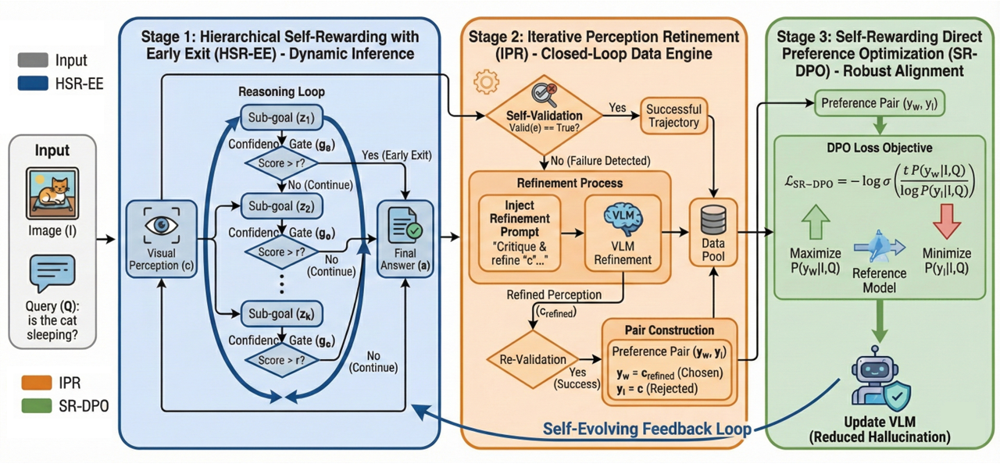
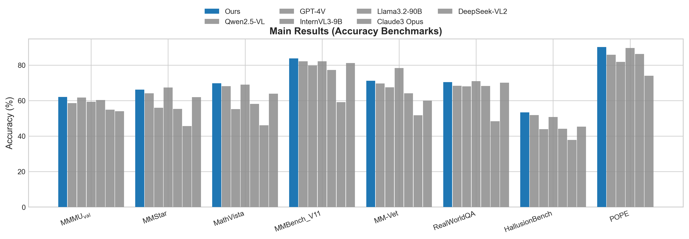

<div align="center">

# From Self-Rewarding to Self-Evolving
## Advancing Vision-Language Models via Hierarchical Reasoning and Preference Optimization

Changbin Cheng<sup>1*</sup>, Jisheng Dang<sup>1</sup>, Hong Peng<sup>1</sup>, Yulan Guo<sup>2</sup>, Bin Hu<sup>3</sup>, Tat-Seng Chua<sup>4</sup>

<sup>1</sup>Lanzhou University &nbsp; <sup>2</sup>National University of Defense Technology &nbsp; <sup>3</sup>Beijing Institute of Technology &nbsp; <sup>4</sup>National University of Singapore

<!-- [](https://arxiv.org/abs/2508.xxxxx) -->
[](LICENSE)
[](https://github.com/volcengine/verl)
[](https://github.com/hiyouga/LLaMA-Factory)

</div>

---

## 📖 Introduction

> **Core Concept**: Transition from "static and passive" self-rewarding to "dynamic and active" self-evolving.

Existing Vision-Language Models (VLMs) are often constrained by **visual hallucinations** and **language shortcuts**. Traditional "self-rewarding" paradigms typically rely on static reasoning chains and coarse-grained binary rewards, making it difficult to handle complex visual logic.

This project is the official implementation of the paper **"From Self-Rewarding to Self-Evolving: A Unified Framework for Vision-Language Models via Hierarchical Reasoning and Preference Optimization"**. We propose a unified **Self-Evolving Framework** that simulates the human "fast thinking and slow thinking" mechanism, achieving adaptive reasoning depth and enabling the model to learn autonomously from its mistakes.

### ✨ Key Features

Our framework consists of three core components:

1.  **🧠 HSR-EE (Hierarchical Self-Rewarding with Early Exit)**: 
    * **Dynamic Reasoning**: Breaks free from fixed computational budgets. Simple perceptual tasks (e.g., "Is there a cat?") can exit early, while complex multi-hop reasoning automatically deepens the reasoning level.
    * **Resolving Paradox**: Effectively balances reasoning efficiency and depth (Efficiency-Depth Paradox).
    
2.  **🔄 IPR (Iterative Perception Refinement)**:
    * **Active Error Correction**: A closed-loop data engine. Instead of discarding failed attempts, it transforms model hallucinations into high-quality "negative samples".
    * **Self-Evolution**: Forces the model to correct perception through "re-examination", generating paired preference data.

3.  **⚖️ SR-DPO (Self-Rewarding Direct Preference Optimization)**:
    * **Fine-grained Alignment**: Utilizes Hard Negatives generated by the VLM itself for direct preference optimization.
    * **Robustness**: Compared to traditional Binary PPO, SR-DPO can more precisely suppress hallucinations and prevent Reward Hacking.

---

## 🚀 Methodology


*(Figure 1 from the paper.)*


### 1. Dynamic Reasoning (Stage 1: HSR-EE)
The model passes through a confidence gate ($g_{\phi}$) after each reasoning step.
- If confidence > threshold $\tau$, the model performs **Early Exit** and outputs the answer.
- Otherwise, continue with deeper Chain-of-Thought reasoning.

### 2. Closed-loop Data Engine (Stage 2: IPR)
When the model's answer is detected as incorrect (based on $a_{gt}$) during training, the IPR module injects a Refinement Prompt ("Your description is inaccurate, please re-examine...") to guide self-correction.
- **Winner ($y_w$)**: Corrected and accurate visual perception.
- **Loser ($y_l$)**: Original hallucinated perception.

### 3. Preference Optimization (Stage 3: SR-DPO)
Using the constructed $(y_w, y_l)$ pairs, we minimize the probability of the hallucination path and maximize the correction path via the DPO objective:

```math
\mathcal{L}_{SR-DPO} = -\mathbb{E} \left[ \log \sigma \left( \beta \log \frac{\pi_{\theta}(y_w|x)}{\pi_{ref}(y_w|x)} - \beta \log \frac{\pi_{\theta}(y_l|x)}{\pi_{ref}(y_l|x)} \right) \right]
```


*(Figure 5 from the paper.)*

---

## 📊 Experimental Results



Our method achieves SOTA performance on multiple benchmarks and significantly reduces language shortcuts.

| Benchmark | Qwen2.5-VL-7B | **Ours** (Self-Evolving) | Improvement |
| :--- | :---: | :---: | :---: |
| **MMMU (Val)** | 58.6 | **62.1** | 🟢 +3.5 |
| **MM-Vet** | 69.7 | **71.2** | 🟢 +1.5 |
| **POPE (F1)** | 85.9 | **90.2** | 🟢 +4.3 |
| **MathVista** | 68.1 | **69.8** | 🟢 +1.7 |

> 📉 **Hallucination Rate**: While maintaining efficient reasoning, we reduce the hallucination rate by **40%+**.

---

## 🛠️ Getting Started

### Requirements

- **Python**: 3.10 or higher
- **GPU**: NVIDIA GPU with at least 24GB VRAM recommended (for full fine-tuning)
- **CUDA**: 11.8 or higher

### Installation

```bash
# Clone the repository
git clone https://github.com/your-org/SR2SE.git
cd SR2SE

# Create virtual environment
conda create -n self-evolving python=3.11
conda activate self-evolving

# Install dependencies
pip install -r requirements.txt
```

### Training Pipeline

Our training consists of three stages:

#### 1. SFT Initialization (based on LlamaFactory)

First, initialize the base VLM with supervised fine-tuning:

```bash
cd LlamaFactory
# Edit the configuration file to specify your dataset and model
python src/train.py \
    --model_name_or_path path/to/base/model \
    --dataset your_dataset_name \
    --output_dir ./output/sft_ckpt \
    --num_train_epochs 3 \
    --learning_rate 5e-5 \
    --per_device_train_batch_size 4 \
    --gradient_accumulation_steps 4
```

#### 2. IPR Data Generation and HSR-EE Training

Generate perception refinement data and train with hierarchical early-exit:

```bash
# Generate IPR training data
python scripts/generate_ipr_data.py \
    --model_path ./output/sft_ckpt \
    --dataset_path path/to/dataset \
    --output_dir ./output/ipr_data

# Train with HSR-EE
python scripts/train_hsr_ee.py \
    --model_path ./output/sft_ckpt \
    --train_data ./output/ipr_data \
    --output_dir ./output/hsr_ee_ckpt \
    --num_train_epochs 5 \
    --confidence_threshold 0.8
```

#### 3. SR-DPO Reinforcement Learning (based on veRL)

Apply preference optimization with self-generated hard negatives:

```bash
cd verl
python -m verl.trainer.main_ray \
    --total_epochs 5 \
    --beta 0.1
```

### Data Preparation

Prepare your training data in the following format:

```json
{
    "image": "path/to/image.jpg",
    "question": "What objects are in the image?",
    "answer": "..."
}
```


### Evaluation

Evaluate model performance on multiple benchmarks:

```bash
cd evalscope
python -m evalscope.run \
    --model_type llm \
    --model_name_or_path ./output/sr_dpo_ckpt \
    --datasets mmmu pope mathvista mm_vet \
    --output_dir ./output/eval_results
```

---

## 🤝 Acknowledgements

This project builds upon the contributions of the open-source community. We especially thank the following excellent open-source projects and research:

- **Baseline & Inspiration**:
  - [Vision-SR1: Self-rewarding vision-language model via reasoning decomposition](https://arxiv.org/abs/2508.19652) (Li et al., 2025)

- **Fine-Tuning Framework**:
  - [LlamaFactory](https://github.com/hiyouga/LLaMA-Factory) - Provides efficient SFT training infrastructure.

- **Reinforcement Learning Framework**:
  - [veRL](https://github.com/volcengine/verl) - Volcano Engine Reinforcement Learning for LLMs. We leverage veRL for efficient SR-DPO training.

- **Evaluation Framework**:
  - [EvalScope](https://github.com/modelscope/evalscope) - A streamlined framework for efficient large model evaluation.

- **Prior Research**:
  - We build upon foundational work from LLaVA, GPT-4V, DeepSeek-R1, and other pioneering multimodal reasoning research.

---

## 🖊️ Citation

If you find this paper or code helpful for your research, please cite:

```bibtex
@article{cheng2026selfevolving,
  title={From Self-Rewarding to Self-Evolving: A Unified Framework for Vision-Language Models via Hierarchical Reasoning and Preference Optimization},
  author={Cheng, Changbin and Dang, Jisheng and Peng, Hong and Guo, Yulan and Hu, Bin and Chua, Tat-Seng},
  journal={IEEE Transactions on Image Processing (Under Review)},
  year={2026}
}
```
